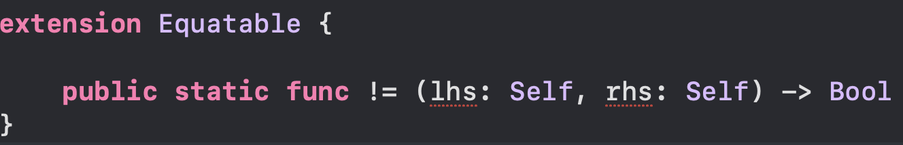

# Opaque Type

[TL;DR](./README.md#tldr)

```Swift
import SwiftUI

struct ContentView: View {
  var body: some View {
      Text("Hello World!")
  }
}
```

SwiftUI 를 살펴보던 중 처음 보는 키워드를 발견하게 되었다. 오늘의 주인공인 `some` 이 무엇인지 살펴보고자 한다.

[Swift 공식 문서](https://docs.swift.org/swift-book/LanguageGuide/OpaqueTypes.html)에 따르면 `some` 은 `Opaque Type` 이라는 문법으로 소개되어 있다.

> A function or method with an opaque return type hides its return value’s type information.

머릿말을 해석해보자면 `Opaque Type` 을 반환 타입(return type)으로 사용하는 함수 또는 메소드는 반환 값의 타입 정보를 감출 수 있다고 쓰여있다.

설명하기에 앞서 문제 상황을 하나 만나보자.

### 베이스 코드

```Swift
struct Point: Equatable {
  var x: Double = 0.0
  var y: Double = 0.0

  static func == (lhs: Self, rhs: Self) -> Bool {
    return lhs.x == rhs.x && lhs.y == rhs.y
  }
}

func createPoint(x: Double, y: Double) -> Point {
  return Point(x: x, y: y)
}

let point1 = createPoint(x: 10, y: 10)
let point2 = createPoint(x: 10, y: 10)

print(point1 == point2) // true
```

예제로 사용할 베이스 코드다. `Point`를 생성해 반환하는 `createPoint` 함수를 만들었다. 이 함수의 헤더 부분을 보면 알 수 있듯이 반환 타입은 `Point` 로 구체 타입을 반환하도록 명시되어 있다.

`Equable` 프로토콜을 채택하고 있어 `point1` 과 `point2` 는 비교 연산을 할 수 있다.

### 코드 확장

만약 다른 종류의 Point 를 만드는 경우가 생긴다면 어떻게 해야할까? 예를 들어, 3차원 좌표를 표현하는 좌표를 추가하고 싶은 경우를 생각해볼 수 있다. 프로토콜을 이용해 추상화해보자.

```Swift
protocol EquatablePoint: Equatable {
    var x: Double { get }
    var y: Double { get }
}

extension EquatablePoint {
  static func == (lhs: Self, rhs: Self) -> Bool {
    return lhs.x == rhs.x && lhs.y == rhs.y
  }
}

struct Point: EquatablePoint {
  // ...
}

struct ThreeDimensionalPoint: EquatablePoint {
  var x: Double = 0.0
  var y: Double = 0.0
  var z: Double = 0

  static func == (lhs: Self, rhs: Self) -> Bool {
    return lhs.x == rhs.x && lhs.y == rhs.y && lhs.z == rhs.z
  }
}
```

`Equatable` 를 채택한 `EquatablePoint` 프로토콜을 만들어 한 단계 추상화했고 `Point`, `ThreeDimensionalPoint` 모두 같은 프로토콜을 채택한다. 새로 만든 구조체는 3차원 좌표 표현을 위해 `z` 속성이 추가되었다.

아, 마지막으로 이제 두 종류의 좌표가 생겼으니 팩토리를 만들어 좌표를 쉽게 만들어보자.

### 문제 상황

```Swift
enum PointFactory {
  static func createPoint(x: Double, y: Double, z: Double? = nil) -> EquatablePoint {
    /* 🚨 ERROR!
      Protocol 'EquatablePoint' can only be used as a generic constraint
      because it has Self or associated type requirements
    */
    if let z = z {
      return ThreeDimensionalPoint(x: x, y: y, z: z)
    }

    return Point(x: x, y: y)
  }
}
```

문제가 생겼다. `Equatable` 프로토콜은 `Self` 를 사용해 `==` 메소드의 매개변수 타입을 추론하기 때문에 프로토콜만으로는 해당 타입이 무엇인지 추론할 수 없어 리턴 타입으로 사용할 수 없다는 에러가 발생한다.

<p align="center">
  
</p>

따라서 프로토콜이 `associated type` 을 가지거나 정의된 메소드의 매개변수, 리턴 타입으로 `Self` 가 사용되면 위의 에러가 발생한다. 에러가 발생했으니 `Point`와 `ThreeDimensionalPoint`를 생성하는 메소드를 각각 만들고 리턴 타입을 구체 타입으로 지정하는 것이 유일한 해결방법일까?

아니다. 우리에겐 구원투수가 남아있다.

### Opaque Type comes into play

이 글의 머릿말에서 `Opaque Type` 을 반환 타입(return type)으로 사용하는 함수 또는 메소드는 반환 값의 타입 정보를 감출 수 있다고 언급했다.

여기서 타입 정보를 감춘다는 의미는 본래 구체타입 정보는 그대로 보존한 상태로 외부에는 자신의 타입을 프로토콜로 노출 시킬 수 있다는 의미다. 코드로 살펴보자.

```Swift
func createPoint(x: Double, y: Double) -> some EquatablePoint {
  return Point(x: x, y: y)
}
```

리턴 타입 앞에 `Opaque Type` 을 의미하는 `some` 을 붙였다. 좀 전에 보았던 에러가 보이지 않은 것을 확인할 수 있다.

앞전에 `Equatable` 프로토콜은 `Self` 를 사용해 `==` 메소드의 매개변수 타입을 추론하기 때문에 프로토콜만으로는 해당 타입이 무엇인지 추론할 수 없어 리턴 타입으로 사용할 수 없다고 말했다. 그렇다면 지금은 왜 문제가 없다고 하는 걸까?

`Opaque Type` 를 사용하면 `createPoint` 함수의 리턴 값은 사용자인 개발자에게 `EquatablePoint` 로 노출된다. 그러나 컴파일러는 실제 리턴 값이 `Point` 구조체인 것을 알고 있다. 때문에 `Equatable` 프로토콜의 `Self` 가 `Point` 임을 알고 있다는 뜻이다.

무언가를 감춘다는 의미는 감추는 누군가는 감춘 것이 무엇인지 알고 있다는 의미도 내포한다. 여기서 타입 정보를 감추는 컴파일러는 실제 타입 정보를 알고 있고 컴파일러가 감춘 타입은 개발자는 볼 수 없다.

실제 함수를 테스트해보면 아래와 같다.

```Swift
let point1 = createPoint(x: 10, y: 10)
let point2 = createPoint(x: 10, y: 10)
let point3 = createPoint(x: 5, y: 5)

print(point1 == point2) // true
print(point2 == point3) // false
```

<ins>`Opaque Type` 의 장점은 `Self`, `associated type` 을 사용하는 프로토콜을 리턴 타입으로 사용할 수 있게 해준다. 이것의 의미는 해당 프로토콜의 기능을 그대로 사용할 수 있다는 의미다.</ins>

팩토리를 수정해보자.

### 문제 상황.2

```Swift
enum PointFactory {
  static func createPoint(x: Double, y: Double, z: Double? = nil) -> some EquatablePoint {
    /* 🚨 ERROR!
      Function declares an opaque return type,
      but the return statements in its body do not have matching underlying types
    */
    if let z = z {
      return ThreeDimensionalPoint(x: x, y: y, z: z)
    }

    return Point(x: x, y: y)
  }
}
```

`createPoint` 함수의 경우처럼 `some` 추가했는데 에러가 발생했다. 다시 한번 잘 생각해보자.

`Opaque Type` 은 타입 정보를 감출 뿐이지 타입 정보는 그대로 유지시키는 타입이다. 따라서 현재 `createPoint` 메소드는 두 가지 타입을 리턴하는 함수라고 볼 수 있다. Swift 는 강타입 언어이다. 때문에 하나의 함수가 여러 종류의 타입을 리턴할 수 없다. 오직 하나의 타입을 리턴 타입으로 지정할 수 있다.

```Swift
enum PointFactory {
  static func createPoint(x: Double, y: Double) -> some EquatablePoint {
    return Point(x: x, y: y)
  }

  static func createPoint(x: Double, y: Double, z: Double) -> some EquatablePoint {
    return ThreeDimensionalPoint(x: x, y: y, z: z)
  }
}
```

함수의 `Overloading` 을 사용해 각각 한 가지 타입을 리턴하는 함수로 분리했다. 비교 연산을 해보자.

```Swift

// 아래 싱수의 타입은 모두 some EquatablePoint 이다.
let threeDimensionalPoint1 = PointFactory.createPoint(x: 10, y: 10, z: 10)
let threeDimensionalPoint2 = PointFactory.createPoint(x: 10, y: 10, z: 10)
let threeDimensionalPoint3 = PointFactory.createPoint(x: 5, y: 5, z: 10)

print(threeDimensionalPoint1 == threeDimensionalPoint2) // true
print(threeDimensionalPoint2 == threeDimensionalPoint3) // false
```

```Swift
// Point
static func == (lhs: Self, rhs: Self) -> Bool {
  return lhs.x == rhs.x && lhs.y == rhs.y
}

// ThreeDimensionalPoint
static func == (lhs: Self, rhs: Self) -> Bool {
  return lhs.x == rhs.x && lhs.y == rhs.y && lhs.z == rhs.z
}
```

이번에는 `ThreeDimensionalPoint` 를 만들어 비교 연산을 해보았다. 그런데 `Point`, `ThreeDimensionalPoint` 구조체 모두 다른 방식으로 `==` 메소드를 구현했다는 사실을 기억해주길 바란다. 서로 다른 구현을 가지고 있지만 컴파일러는 `Opaque Type` 아래 감춰진 구체 타입 정보를 알고 있다. 때문에 감추어진 타입이 가진 메소드를 호출한다.

따라서 `ThreeDimensionalPoint` 에서 구현된 `==` 메소드를 호출한다.

### 이게 전부인가?

`Opaque Type` 을 사용하면 제한 되었던 프로토콜의 기능을 사용할 수 있다는 장점이 있다는 건 이해했을 것이다. 그럼 <ins>`Self` 나 `associated type` 을 사용하지 않는 프로토콜만 사용할 경우에는 굳이 사용할 필요가 있을까?</ins>

아니다. `Opaque Type` 의 가장 큰 장점을 소개하겠다.

### Transformation

`Opaque Type` 을 사용하면 구체 타입은 그대로 보존된다는 사실을 기억해주길 바란다.

여기서 구체 타입이란 결국 특정 프로토콜을 채택한 타입을 의미한다. 그렇다면 특정 프로토콜을 채택한 타입을 인자로 하는 함수에 전달할 수 있다는 것을 의미한다.

<ins>**_함수의 매개변수 타입을 특정 프로토콜을 채택한 타입으로 지정하는 것과 프로토콜로 지정하는 것에는 큰 차이가 있다._**</ins>

코드를 살펴보자.

```Swift
protocol Shape {
  func draw() -> String
}

struct Triangle: Shape {
  func draw() -> String {
    return """
           *
           **
           ***
           """
    )
  }
}

struct FlippedShape<T: Shape>: Shape {
  var shape: T
  func draw() -> String {
    let lines = shape.draw().split(separator: "\n")
    return lines.reversed().joined(separator: "\n")
  }
}

let triangle = Triangle() // Type is Triangle
let flippedShape = FlippedShape(shape: triangle) // Type is FlippedShape<Triangle>
```

`Triangle`, `FlippedShape` 모두 Shape 프로토콜을 채택하고 있다.

### Case.1 매개변수의 타입이 프로토콜인 경우

```Swift
func flip(_ shape: Shape) -> some Shape {
  /* 🚨 ERROR!
   Protocol 'Shape' as a type cannot conform to the protocol itself
  */
  return FlippedShape(shape: shape)
}

let triangle = Triangle()
let flippedTriangle = flip(triangle) // 🚨 ERROR!
```

에러 메시지에 `Shape as a type` 라고 언급된 것처럼 매개변수 shape 은 `Shape` 프로토콜을 채택한 타입을 의미하지 않는다. 즉, Shape 이라는 프로토콜 타입을 매개변수의 타입으로 정했다는 것이다.

- 매개변수의 타입을 Int, String, Bool 로 지정하는 것처럼 프로토콜이라는 타입으로 지정했을 뿐이다.

반면, FlippedShape 구조체의 매개변수는 Shape 프로토콜을 채택한 타입을 매개변수 타입으로 하기 때문에 두 타입이 같지 않다.

### Case.2 매개변수의 타입이 제너릭인 경우

```Swift
func flip<T: Shape>(_ shape: T) -> some Shape {
  return FlippedShape(shape: shape)
}

let triangle = Triangle()
let flippedTriangle = flip(triangle) // ✅
flippedTriangle.draw()
// ***
// **
// *
```

제너릭을 사용하면 매개변수의 타입을 프로토콜을 채택한 타입으로 정의할 수 있다.

## TL;DR

1. `Opaque Type` 은 함수와 메소드 리턴 값의 타입 정보를 감추지만 본래의 타입 정보를 보존한다.
   - 클라이언트는 감춰진 타입 정보에 접근할 수 없지만 컴파일러는 접근할 수 있다.
2. [구체 타입이 보존되어있기 때문에 `Self`, `associated type` 을 사용하는 프로토콜도 리턴 타입으로 사용할 수 있다.](https://docs.swift.org/swift-book/LanguageGuide/OpaqueTypes.html#ID614)
3. 3 의 경우 타입캐스팅을 하지 않고 해당 프로토콜의 기능을 그대로 사용할 수 있다.
4. [함수의 매개변수 타입이 특정 프로토콜을 채택한 타입인 경우 `Opaque Type` 을 인자로 전달할 수 있다.](https://docs.swift.org/swift-book/LanguageGuide/OpaqueTypes.html#ID615)
   - 반면, 전달하고자하는 인자의 타입이 프로토콜인 경우에는 전달할 수 없다.
